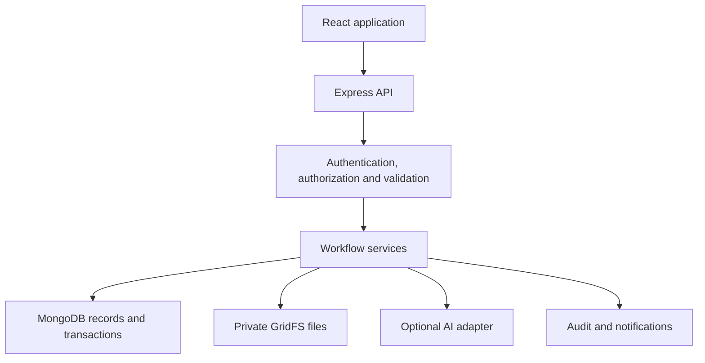

# SAMARTHYA

### Digital Capacity Building & Learning Management Platform

SAMARTHYA is a MERN application that connects training needs, courses, trainers, assessments and evidence-backed competency development in one traceable workflow.

**Learning is not the final outcome. Demonstrated capability is.**

The platform provides dedicated workspaces for trainees, trainers and administrators, with transparent eligibility checks, explainable trainer recommendations and human-controlled competency verification.

> **Project status:** Demonstration application using synthetic data. SAMARTHYA is not an official IMD deployment. Competency levels, role mappings, eligibility rules and analytical thresholds are proposed application configurations, not official IMD or WMO standards.

## Contents

- [Overview](#overview)
- [Core Workflow](#core-workflow)
- [Features](#features)
- [User Roles](#user-roles)
- [Technology Stack](#technology-stack)
- [Architecture](#architecture)
- [Getting Started](#getting-started)
- [Demo Accounts](#demo-accounts)
- [Testing](#testing)
- [API Overview](#api-overview)
- [Security and Data Integrity](#security-and-data-integrity)
- [Optional AI Assistance](#optional-ai-assistance)
- [Demo Dataset](#demo-dataset)
- [Demo Script](#demo-script)
- [Application Rules](#application-rules)
- [Troubleshooting](#troubleshooting)
- [Deployment Considerations](#deployment-considerations)
- [Limitations](#limitations)

## Overview

SAMARTHYA helps organizations manage the complete training lifecycle:

- Identify training needs from role requirements and available competency evidence.
- Connect approved needs to learning paths and relevant courses.
- Evaluate eligibility and manage nominations, reviews and batch admission.
- Discover suitable trainers using transparent, configurable criteria.
- Deliver learning resources and conduct assessments.
- Publish results through authorized review.
- Record competency decisions supported by reviewed evidence.
- Track follow-up actions and organizational competency coverage.

The platform separates **course completion**, **assessment results**, **evidence acceptance** and **demonstrated competency**. None automatically substitutes for another.

## Core Workflow

### Training planning and admission

Training need → Review → Learning-path assignment → Course and batch selection → Eligibility check → Nomination → Authorized approval → Seat allocation

Nominations can also be returned for correction or waitlisted when appropriate.

### Training delivery and evaluation

Trainer discovery → Suitability review → Human assignment → Learning → Assessment → Evaluation → Result publication

### Competency development

Evidence submission → Evidence review → Human competency decision → Competency history update → Skill-gap recalculation → Follow-up

Organizational dashboards summarize the resulting records within the authorized scope.

## Features

### Competency Framework and Skill Gaps

- Configurable competencies and professional-role requirements.
- Versioned competency records.
- Separation of self-declared skills and reviewed competency records.
- Transparent comparison of required and demonstrated levels.
- Explicit handling of missing or non-comparable evidence.
- Competency history with supporting decisions and evidence.

### Training Needs and Learning Paths

- Training-need submission and review.
- Ordered learning paths linked to competency goals.
- Course recommendations through configured mappings.
- Follow-up actions linked to further learning needs.

### Courses, Eligibility and Admission

- Course catalogue and versioned course rules.
- An approved trainer can create, edit and publish their own valid course without a separate course-approval step.
- Trainer-owned modules and private learning resources use course ownership; assigned batch content additionally uses explicit `MANAGE_LEARNING` scope.
- Publishing a course does not create a batch, allocate a seat or grant access to learner submissions and assessments.
- Batch schedules, capacity and delivery information.
- Eligibility checks with visible reasons.
- Nomination submission, return and resubmission.
- Waitlisting and authorized approval.
- Transactional seat allocation and cancellation.
- Training calendar and notifications.

### Trainer Management

- Trainer profiles, qualifications and expertise.
- Reviewed expertise records and availability.
- Explainable suitability recommendations.
- Mandatory eligibility checks before ranking.
- Explicit coordinator assignment.
- Scheduling-conflict checks and replacement history.

### Learning and Assessments

- Protected learning resources and progress tracking.
- Reviewed MCQ question bank.
- Versioned assessments and practical rubrics.
- Server-controlled attempts, deadlines and scoring.
- Practical and written submission revisions.
- Scoped human evaluation.
- Controlled result publication and correction history.

### Evidence and Competency Decisions

- Versioned evidence submissions.
- Assigned-reviewer workflows.
- Acceptance, rejection and revision requests.
- Separate subject-reviewer competency decisions.
- Auditable competency updates.
- Preservation of valid lower-level competency when a higher-level task requires practice.

### Organizational Visibility

- Competency coverage with counts and denominators.
- Separate reporting of known gaps and missing evidence.
- Trainer coverage and availability.
- Transparent capability indicators.
- Follow-up tracking and audit logs.

### Optional AI Assistance

- Candidate skill extraction.
- Competency-tag suggestions.
- MCQ drafting from authorized learning material.
- Human review before suggestions affect application records.
- Manual workflows when AI is disabled or unavailable.

## User Roles

| Role                    | Main responsibilities                                                                                                                           |
| ----------------------- | ----------------------------------------------------------------------------------------------------------------------------------------------- |
| **Trainee**             | Maintain a profile, review skill gaps, request training, submit nominations, access enrolled learning, attempt assessments and submit evidence. |
| **Trainer**             | Maintain expertise and availability, deliver assigned training, manage authorized learning resources and evaluate assigned submissions.         |
| **Admin / Coordinator** | Configure training, review requests, manage admissions, assign trainers and reviewers, monitor coverage and inspect audit records.              |

Application access roles are separate from professional job roles.

Sensitive actions also depend on ownership, batch assignment, reviewer scope or publication permissions. An administrator account alone does not establish subject expertise.

## Technology Stack

| Layer                | Technology                                        |
| -------------------- | ------------------------------------------------- |
| Frontend             | React 18, Vite, React Router, Axios               |
| Backend              | Node.js, Express                                  |
| Database             | MongoDB with Mongoose                             |
| Authentication       | JWT                                               |
| Password hashing     | bcrypt                                            |
| Validation           | Zod and workflow-specific server validation       |
| Private file storage | MongoDB GridFS                                    |
| Data consistency     | MongoDB transactions, indexes and revision checks |
| AI                   | Optional server-side structured provider adapter  |
| Test database        | MongoDB Memory Server in replica-set mode         |

## Architecture

The React client communicates with Express APIs using JWT bearer authentication.

The backend applies authentication, authorization and validation before executing workflow services. MongoDB stores application records, while GridFS stores private files with separate metadata.



### Repository Organization

| Location               | Purpose                                           |
| ---------------------- | ------------------------------------------------- |
| `client/`              | React application and shared UI components        |
| `server/`              | Express backend and server configuration          |
| `server/src/models/`   | Users, training, assessment and competency models |
| `server/src/services/` | Business rules and workflow services              |
| `server/src/routes/`   | Permission-scoped API routes                      |
| `server/src/seed/`     | Synthetic demonstration data                      |
| `docs/`                | Implementation documentation                      |
| `test-results/`        | Generated browser-test artifacts                  |

## Getting Started

### Prerequisites

- Node.js **22 or later**
- npm
- A replica-set-capable MongoDB deployment
- `mongosh` when using the local MongoDB setup below

MongoDB transactions are required for admission, cancellation and other consistency-sensitive workflows.

A standalone MongoDB instance without replica-set support is insufficient.

### 1. Install Dependencies

From the repository root:

```bash
npm install
npm install --prefix server
npm install --prefix client
```

### 2. Create Environment Files

Copy the example files if local `.env` files do not already exist:

```bash
cp server/.env.example server/.env
cp client/.env.example client/.env
```

Use the variable names and configuration instructions in those example files.

Important settings include:

| Variable              | Purpose                                         |
| --------------------- | ----------------------------------------------- |
| `MONGO_URI`           | MongoDB connection string                       |
| `ADMIN_SEED_EMAIL`    | Email for the seeded administrator              |
| `ADMIN_SEED_PASSWORD` | Password for the seeded administrator           |
| `DEMO_REFERENCE_DATE` | Reference date for synthetic training schedules |
| `AI_ENABLED`          | Enables or disables optional AI assistance      |

Also configure the authentication, server and frontend connection settings required by the example files.

For local testing without an AI provider:

```env
AI_ENABLED=false
```

Never commit real `.env` files, passwords, database credentials or API keys.

### 3. Configure MongoDB

Use a replica-set-capable MongoDB deployment.

For a local single-node replica set, create a data directory from the repository root:

```bash
mkdir -p data
```

Start MongoDB in a separate terminal:

```bash
mongod --dbpath ./data --replSet rs0 --bind_ip 127.0.0.1
```

Keep that process running.

In another terminal, initialize the replica set once:

```bash
mongosh --eval 'rs.initiate()'
```

Set the server connection string:

```env
MONGO_URI=mongodb://127.0.0.1:27017/samarthya?replicaSet=rs0
```

Do not run initialization again for an already initialized replica set.

Keep local database files out of version control.

### 4. Create the Administrator and Demo Data

Set `ADMIN_SEED_EMAIL` and `ADMIN_SEED_PASSWORD` in `server/.env`, then run:

```bash
npm run seed:admin --prefix server
npm run seed:demo --prefix server
```

The demo seed:

- Is disabled in production.
- Uses a dedicated synthetic-data namespace.
- Is idempotent.
- Does not delete or rewrite unrelated records.

### 5. Start the Backend

In one terminal, from the repository root:

```bash
npm run dev --prefix server
```

### 6. Start the Frontend

In a second terminal:

```bash
npm run dev --prefix client
```

Open the local URL printed by Vite.

Ensure the frontend API configuration points to the running backend and that the backend permits the configured frontend origin.

## Demo Accounts

Run the seed commands before using these accounts.

| Workspace             | Email                                                    | Password                       |
| --------------------- | -------------------------------------------------------- | ------------------------------ |
| Admin / Coordinator   | Value of `ADMIN_SEED_EMAIL`                              | Value of `ADMIN_SEED_PASSWORD` |
| Asha Sharma — Trainee | `asha.sharma@example.test`                               | `DemoOnly!2026`                |
| Additional trainees   | `trainee2@example.test` through `trainee10@example.test` | `DemoOnly!2026`                |
| Trainers              | `trainer1@example.test` through `trainer3@example.test`  | `DemoOnly!2026`                |

> These accounts and shared passwords are for local synthetic testing only. Do not expose them in a production deployment.

## Testing

Run the backend test suite:

```bash
npm test --prefix server
```

Build the frontend:

```bash
npm run build --prefix client
```

Run end-to-end tests from the repository root:

```bash
npm run test:e2e
```

The E2E runner uses dedicated defaults `127.0.0.1:5100` for its isolated API and `127.0.0.1:5174` for its browser client, so it can run while the normal development ports are occupied. Override them with `E2E_API_PORT` and `E2E_WEB_PORT` when required.

The backend suite uses MongoDB Memory Server in replica-set mode and needs permission to bind localhost ports.

Browser-test artifacts are written to `test-results/`, including screenshots at desktop, tablet and mobile widths.

Test commands document the verification workflow; they do not imply that tests have passed in every environment.

### Manual Verification Checklist

- [ ] Login works for trainee, trainer and administrator accounts.
- [ ] Protected pages enforce role and ownership restrictions.
- [ ] Training needs can be submitted and reviewed.
- [ ] Eligibility checks explain missing or unmet requirements.
- [ ] Nominations support correction, review and admission.
- [ ] Batch capacity is enforced.
- [ ] Trainer recommendations show their reasoning.
- [ ] Trainer assignment requires explicit authorization.
- [ ] Enrolled trainees can access learning resources.
- [ ] Assessment scoring happens server-side.
- [ ] Results remain private until published.
- [ ] Evidence is accessible only to authorized users.
- [ ] Competency decisions preserve evidence and history.
- [ ] Skill gaps and coverage reflect updated records.
- [ ] Core workflows function with AI disabled.

## API Overview

All API routes use the `/api` prefix and the existing response envelope:

```json
{
  "success": true,
  "data": {},
  "message": "..."
}
```

Protected endpoints use JWT bearer authentication.

### API Areas

| Area                 | Capabilities                                                  |
| -------------------- | ------------------------------------------------------------- |
| Identity             | Authentication, profiles and user management                  |
| Competencies         | Framework, job roles, records and gaps                        |
| Training planning    | Training needs and learning paths                             |
| Courses and batches  | Catalogue, schedules, eligibility and capacity                |
| Nominations          | Submission, review, waitlisting and admission                 |
| Trainers             | Profiles, expertise, availability, suitability and assignment |
| Learning             | Modules, resources and progress                               |
| Assessments          | Questions, attempts, submissions and evaluation               |
| Results              | Publication, version history and corrections                  |
| Evidence             | Submission, review and revision                               |
| Competency decisions | Human decisions, passport and history                         |
| Follow-up            | Further practice and linked learning needs                    |
| Capability           | Coverage and application-level indicators                     |
| AI                   | Optional reviewed suggestions and drafting                    |
| Operations           | Notifications, calendar, dashboards and audit                 |

Route definitions in `server/src/routes/` are the authoritative reference for exact endpoint paths. Some internal route names retain legacy implementation prefixes.

### HTTP Status Codes

| Code  | Meaning                                 |
| ----- | --------------------------------------- |
| `401` | Authentication required                 |
| `403` | Action not permitted                    |
| `404` | Resource not found                      |
| `409` | Revision, capacity or workflow conflict |

The server derives ownership from the authenticated account instead of trusting client-supplied identity.

## Security and Data Integrity

### Authentication and Authorization

- JWT-protected APIs.
- Approved-account checks.
- bcrypt password hashing with cost 12.
- Password exclusion from normal queries and serialization.
- Role, ownership, batch and reviewer-scoped authorization.
- Explicit permission checks for evaluation and publication.

### Admission Consistency

Admission runs in a MongoDB transaction that:

1. Checks the nomination revision.
2. Re-evaluates eligibility using the batch’s pinned rule version.
3. Conditionally reserves capacity.
4. Creates or reactivates the unique enrollment.
5. Updates nomination status.
6. Writes the audit event.

Unique indexes and conditional capacity updates protect against duplicate enrollment and final-seat races.

Notifications are written after commit and use recipient/event identifiers to prevent duplicates.

### Assessment Integrity

- Published question versions remain frozen.
- The server controls attempt timing and question order.
- Scores are calculated server-side.
- Evaluators cannot exceed rubric limits.
- Results require authorized publication.
- Corrections preserve earlier result versions.

### Private Files

Protected files use GridFS and separate metadata records.

Implemented controls include:

- A 5 MB upload limit.
- Allowed PDF, PNG, JPEG and text formats.
- Signature/content validation.
- Sanitized filenames.
- SHA-256 metadata.
- Authorized downloads.

Access depends on file purpose, ownership, enrollment and assigned workflow scope. Private evidence is not intended for public access.

### Auditability

Important actions retain actor, timestamp, affected record and relevant reasons or changes.

Competency updates preserve the supporting decision and evidence references. Repeated decision requests are protected through idempotency controls.

## Optional AI Assistance

AI supports human work; it does not replace authorization or subject review.

| Feature             | Output                                                  | Required human control    |
| ------------------- | ------------------------------------------------------- | ------------------------- |
| Skill extraction    | Candidate profile skills                                | Accept, edit or reject    |
| Competency matching | Suggested catalogue mappings                            | Confirm the mapping       |
| MCQ drafting        | Unpublished questions from authorized learning material | Review before publication |

Accepted skill suggestions remain self-declared profile information.

AI cannot independently:

- Approve admission.
- Assign trainers.
- Publish results.
- Verify competency.
- Promote proficiency.

### Configuration

Optional server settings include:

```env
AI_ENABLED=false
AI_PROVIDER=
AI_MODEL=
AI_API_KEY=
AI_BASE_URL=
AI_TIMEOUT_MS=
AI_RETRY_LIMIT=
AI_REQUEST_LIMIT=
AI_EXTERNAL_DATA_APPROVED=false
```

Use `server/.env.example` for supported values and defaults. Leave optional numeric settings at their documented defaults rather than copying empty values into an enabled configuration.

External processing requires the explicit data-handling gate.

When AI is disabled or unavailable:

- Core workflows remain usable.
- Deterministic catalogue matching remains available.
- Manual profile and question editing remain available.
- The application must not present fabricated provider output.

Provider responses are schema-validated. Audit records exclude API keys and full source documents.

Live provider behavior is not verified by the repository test suite.

## Demo Dataset

The synthetic dataset includes:

- Ten trainees.
- Three trainers.
- Ten task competencies.
- One proposed professional job role.
- Five published sample courses.
- Three learning paths.
- Future training batches.
- Learning modules and reviewed assessment examples.
- Returned and waitlisted nominations.
- Capacity-sensitive admission examples.
- Trainer availability and replacement examples.
- A submitted nomination awaiting review.
- A practical submission returned for revision.
- An evidence record awaiting trainee revision.
- Versioned competency and evidence scenarios.

One example gives Asha a reviewed synthetic L2 Radar Product Interpretation record against a proposed L4 requirement. A separate Radar Quality Control record remains not assessed.

Demo schedules use `DEMO_REFERENCE_DATE` to support a controlled presentation timeline.

## Demo Script

Use the [5–7 minute synthetic lifecycle script](docs/demo-script.md) to demonstrate one connected trainee journey through needs, admission, trainer selection, assessment, evidence, competency history, follow-up and organizational coverage. Run the idempotent demo seed first and keep the “Demo data” labels visible during the presentation.

## Application Rules

The following rules are configurable demonstration policies and require organizational validation before real deployment:

- Competency scales and professional-role mappings.
- Eligibility requirements.
- Nomination and approval transitions.
- Reviewer and publisher permissions.
- Trainer suitability weights.
- Assessment windows, attempts and pass requirements.
- Capability indicator thresholds.

### Important Distinctions

| Situation                        | Application treatment                               |
| -------------------------------- | --------------------------------------------------- |
| Course completed                 | Learning completion recorded                        |
| Assessment passed                | Assessment outcome recorded                         |
| Evidence accepted                | Evidence accepted for its stated purpose            |
| Competency demonstrated          | Explicit authorized competency decision             |
| Evidence missing                 | `NOT_ASSESSED`, with no assumed zero level          |
| Higher-level task needs practice | Existing valid lower level is preserved             |
| Batch full                       | Capacity outcome, not failed eligibility            |
| Waitlisted nomination            | Requires a fresh coordinator decision for admission |

Batch rules are pinned to a version. Publishing a newer course-rule version does not silently change existing batch rules.

Archived courses remain available to existing applicants and enrollees but do not accept new nominations.

Timestamps are stored as dates and displayed with timezone context. Demo batches use `Asia/Kolkata`.

### Trainer Suitability

Mandatory checks run before ranking:

- Active account.
- Reviewed matching expertise.
- Required proficiency and qualifications.
- Availability.
- Schedule compatibility.
- Delivery mode and location.

Eligible trainers receive a score using configurable weights:

| Factor              |  Points |
| ------------------- | ------: |
| Competency match    |      35 |
| Proficiency         |      20 |
| Qualification       |      10 |
| Relevant experience |      10 |
| Teaching experience |      10 |
| Domain relevance    |      10 |
| Availability fit    |       5 |
| **Total**           | **100** |

These are recommendation points, not probabilities or official competency percentages.

### Organizational Coverage

Coverage counts distinct active approved trainees against configured job-role requirements.

Reports distinguish:

- Meeting the requirement.
- Known below-required level.
- Not assessed.
- Not comparable.
- Review due.

Trainer coverage is calculated separately. Indicators describe recorded data, not unobserved workforce capability.

## Troubleshooting

| Problem                                         | Check                                                                                          |
| ----------------------------------------------- | ---------------------------------------------------------------------------------------------- |
| Backend cannot connect to MongoDB               | Verify `MONGO_URI`, database availability and connection permissions.                          |
| Transactions fail                               | Confirm MongoDB is running as a replica set and initialization has completed.                  |
| Frontend cannot reach the API                   | Check the backend process, frontend API URL and allowed origin configuration.                  |
| Login fails                                     | Confirm the account exists, is approved and uses the correct seeded or configured credentials. |
| Demo events appear outside the desired timeline | Review `DEMO_REFERENCE_DATE` and the seed configuration.                                       |
| Upload fails                                    | Check authorization, file format and the 5 MB limit.                                           |
| AI is unavailable                               | Use manual workflows or verify provider settings and the external-data approval gate.          |
| Tests cannot start the database                 | Ensure the environment permits localhost binding for MongoDB Memory Server.                    |

Do not bypass authorization or weaken validation to resolve setup errors.

## Deployment Considerations

Before exposing the application beyond local testing:

- Use a dedicated deployment database.
- Configure a replica-set-capable MongoDB service.
- Configure production origins, secrets and authentication settings.
- Enable HTTPS through the deployment infrastructure.
- Remove or disable shared demo credentials.
- Review file access, upload handling and storage capacity.
- Establish backups and test restoration.
- Review logs, monitoring and operational recovery.
- Validate organizational roles, review authority and retention requirements.
- Verify any enabled AI provider with authorized data.
- Complete security and end-to-end testing in the deployment environment.

The development commands above do not constitute a production deployment procedure.

### Existing architecture deployment outline

1. Build the client with `npm ci --prefix client` and `npm run build --prefix client`.
2. Publish `client/dist/` through an HTTPS static host or reverse proxy.
3. Route browser requests under `/api` to the Express service. If the API has a separate origin, build the client with the approved `VITE_API_URL` value and set `CLIENT_ORIGIN` to the exact frontend origin.
4. Install server production dependencies with `npm ci --omit=dev --prefix server`.
5. Run the API from the repository root with `NODE_ENV=production npm run start --prefix server` under a supervised process manager supplied by the hosting environment.
6. Use a replica-set-capable MongoDB deployment, a unique 32-character-or-longer `JWT_SECRET`, HTTPS, restricted database credentials and protected environment-variable storage.
7. Do not run `seed:demo` in production. The script rejects `NODE_ENV=production`; shared local demo credentials must never be copied into a deployment database.
8. Keep GridFS private behind the authenticated API. Configure database backups, storage monitoring, log retention and malware scanning before accepting real documents.
9. Leave `AI_ENABLED=false` unless an approved provider, model, data-handling configuration and secret store have been verified in that environment.

The repository does not include a reverse proxy, TLS termination, process manager, malware scanner or cloud-specific infrastructure definition. Those controls must be supplied and verified by the chosen deployment environment.

## Limitations

- The dataset is synthetic and does not represent actual IMD employees or organizational outcomes.
- Workflow rules and competency mappings require domain validation.
- Application indicators are not validated workforce predictions.
- Live AI provider behavior requires separate verification.
- The platform does not claim official government integrations, endorsement or production security certification.
- Older experimental modules remain unmounted; the active route configuration determines available application behavior.
